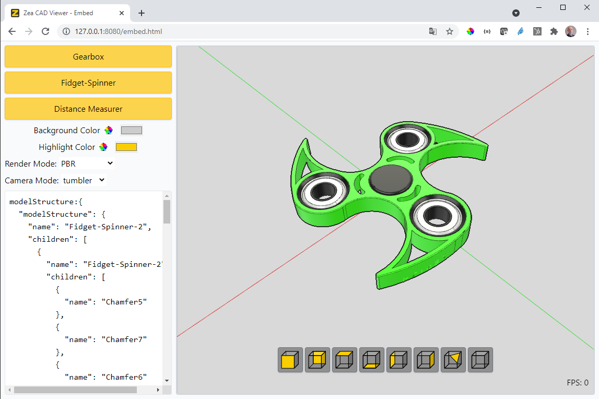

# Zea CAD Viewer

The zea-cad-viewer is an embeddable web application for viewing CAD data. It is intended to be integrated into host applications that might need to support displaying 3D cad data in the browser.

# Processing CAD files using the zea-cloud API.

zcad file can be produced using a few different mechanisims. The Zea Cloud Hello world project shows you how to use the Cloud APIs to process files and download them to your system, or directly launch the viewer.

https://github.com/ZeaInc/zea-cloud-hello-world

# Embedding the Zea CAD Viewer in your own Web App

## Live Demo

The Embed view shows how the zea-cad-viewer would be displayed within the context of another application, embedded as an iFrame. The host application can then control the embedded zea-cad-viewer via the JSON API and the Channel Messenger classes.

-

> https://docs.zea.live/zea-cad-viewer/embed.html

# Getting Started

To test zea-cad-viewer embedded on your system, and follow the following steps.

# Add the iframe tag.

Add an iframe tag to your application, and specify the URL of the viewer.

```html
<iframe
  id="zea-cad-viewer"
  src="https://cad-viewer-staging.zea.live/?embedded"
></iframe>
```

# Connect the Channel Messenger.

Using JavaScript, import the ChannelMessenger and construct an instance passing the iframe tag.

```html
<script type="module">
  import { ChannelMessenger } from 'https://docs.zea.live/zea-cad-viewer/ChannelMessenger.js'

  const viewer = document.getElementById('zea-cad-viewer')

  const client = new ChannelMessenger(viewer)
  client.on('ready', (data) => {
    logger.log('Ready')
  })
</script>
```

The ChannelMessenger establishes a connection to the viewer, which allows the host application to send commands to the viewer, and receive events and data back from the viewer.

## Commands

The ChannelMessenger enables a host application to send arbitrary commands to the embed window and receive data in response.

### events vs send & get commands

Commands fall into 3 categories, 'event', 'send' and 'get'.

#### Events

Events are receive data from the embed page and are used to push data from the embed to the host. This could include telling the host that the used has clicked on a specific geometry.

To implement an event, when the event must be related to the host, simply send the event over the channel messenger.

##### In the Svelte App code

```javascript
  // After 20 seconds, we tell the user something..
  setTimout(() => {
    client.send('gameOver', { info: ... })
  }, 20000)
```

##### In the Host App code

In your host application, you listen for this event using the channel messenger. You can then handle the event how you wish.

```javascript
client.on('somethingChanged', (data) => {
  console.log('selectionChanged:', data)
})
```

Within the zea-cad-viewer code, you can add support for your own commands by adding handlers for various command names.

#### Send Commands

Used to send a command from the host page to the embed page, but a response is not expected.

##### In the Svelte App code

So implement a 'send' command, simply add code to the zea-cad-viewer that listens for your specific message, and implement some logic.

```javascript
  client.on('changeSomething', (data) => {
    // The host wants us to change something. Lets do it.
    ....
    // Return a simple 'done' value to let the host know that it completed.
    if (data._id) {
      client.send(data._id, { done: true })
    }
  })
```

##### In the Host App code

Then in your host application, you can now invoke the command using the channel messenger.

```javascript
client.do('changeSomething', { arg: 'Important Info' })
```

The zea-cad-viewer will receive the message and apply the requested changes.

# JSON API

The zea-cad-viewer accepts a range of commands sent via the ChannelMessenger interface. These commands represent a sample set of commands for you to check out and use to base your own commands.

## Events

The Svelte App might emit events based on interactions within the viewer or other reasons. The host web application can listen to these events and respond.

#### Ready

The ready event is sent as soon as the zea-cad-viewer frame has loaded, and the ChannelMessenger has established a connection with the page.

```javascript
client.on('ready', (data) => {
  console.log('zea-cad-viewer is ready to load data')
})
```

#### selectionChanged

The selectionChanged event is sent when the selection changes in the selection manager in the app.

```javascript
client.on('selectionChanged', (data) => {
  console.log('selectionChanged:', data)
})
```

## Commands

The commands are structured in the following way.

> Command Name: The command name is a string describing which command should be invoked in the viewer.
> Payload: The payload is a json structure containing relevant information needed to process the command.
> Results: Each command returns a promise that resolves to some result returned by the zea-cad-viewer

```javascript
do('command-name', payload).then((results) => {
  // process or display the results.
})
```

#### Load Data

```javascript
client
  .do('loadCADFile', {
    url: '../foo.zcad',
    addToCurrentScene: false,
    convertZtoY: true,
    resources: { 'Foo.step': 'url/to/Foo.step.zcad' },
  })
  .then((data) => {
    console.log('loadCADFile Loaded', data)
  })
```

##### Payload:

zcad: the URL of the zcad accessible to the app.
addToCurrentScene: If set to true, adds the new file to the scene containing the existing file. Else the scene is cleared and the new file is loaded.
convertZtoY: If the data coordinates expected 'Y' up, this parameter rotates the model to correctly orient the data according to the viewer axis system.
resources: The Resources option is a dictionary mapping source CAD files to the converted zcad files.

The zcad file format now supports XRefs. XRefs are simply a CADAsset which is embedded into the tree of another zcad file. During loading, the XRef loads and it contains a reference to a CAD file that it must load.

The XRef looks up the resources table using the name of the original CAD file as the key. If the resources tables provides a urls for that source CAD file name, it will load that url.

The resources dictionary can be generated from a Bill Of Materials, and allows the loading code to specify exactly which part should be loaded into the assembly.

e.g. You might have a Part called Part.step, but 2 different versions of the Part. e.g. Part.1.step and Part.2.step. The resources table can provide the url for the Part that you intend to load, based on a BOM configuration.

To load version one off the Part, provide the url for that version in the resources table.

```
{
  "Part.step": "url/to/Part.1.step"
}
```

To load version 2 off the Part, provide the url for that version in the resources table.

```
{
  "Part.step": "url/to/Part.2.step"
}
```

> Note: To filter out parts or sub assembly from your assembly, simply omit those parts from the resources table.

> Note: If no resources dictionary is provided, XRefs will generate a url relative to the url of the assembly zcad file. The generated url uses a zcad naming convention which includes the original file name and suffix. So if a source CAD file was called 'Foo.step', the generated url will append '.zcad' to the source filename, giving 'Foo.step.zcad'.

##### Live BOM Demo

The BOM demo is a sample that loads an assembly made up of many individual zcad files. A root assembly zcad file is loaded, while being provided a resources tables specifying which parts to load.

See the individual assembly and part zcad files here:

> https://github.com/ZeaInc/zea-cad-viewer/tree/main/docs/data/SolidworksTrailor

Load the trailer using BOM1

https://docs.zea.live/zea-cad-viewer/BOM.html?BOM=/data/BOM1.json

Load the trailer using BOM2

https://docs.zea.live/zea-cad-viewer/BOM.html?BOM=/data/BOM2.json

##### Results:

The command returns a JavaScript object containing high level data about the loaded project.

#### Get Model Structure

Retrieves the model structure of the loaded data.

```javascript
client.do('getModelStructure', {}).then((data) => {
  console.log('model structure:', data)
})
```

##### Results:

The command returns a JavaScript object containing high level data about the loaded project.

#### Set Background Color

Sets the background color of the viewport.

```javascript
client.do('setBackgroundColor', { color: '#FF0000' })
```

#### Set Highlight Color

Sets the color used to provide silhouette borders around selected objects.

```javascript
client.do('setHighlightColor', { color: '#FF0000' })
```

#### Set Render Mode

Sets the render mode currently used by the renderer.

Possible Values are:

- "WIREFRAME"
- "FLAT"
- "HIDDEN_LINE"
- "SHADED"
- "PBR"(default)

```javascript
client.do('setRenderMode', { mode: 'FLAT' })
```

#### Set Camera Manipulation Mode

Sets the method used to manipulate the view.

Possible Values are:

- "TURNTABLE": Better for scenes where the user should always be vertical in the scene. e.g. architectural scenes, or large CAD models.
- "TUMBLER"(default): Better for scenes were the user wants to look at the data from any point of view, including upside down, and the 'up' direction isn't important to the user.
- "TRACKBALL" Better for scenes were the user wants to look at the data from any point of view, including upside down, and the 'up' direction isn't important to the user.

```javascript
client.do('setCameraManipulationMode', { mode: 'TURNTABLE' })
```
