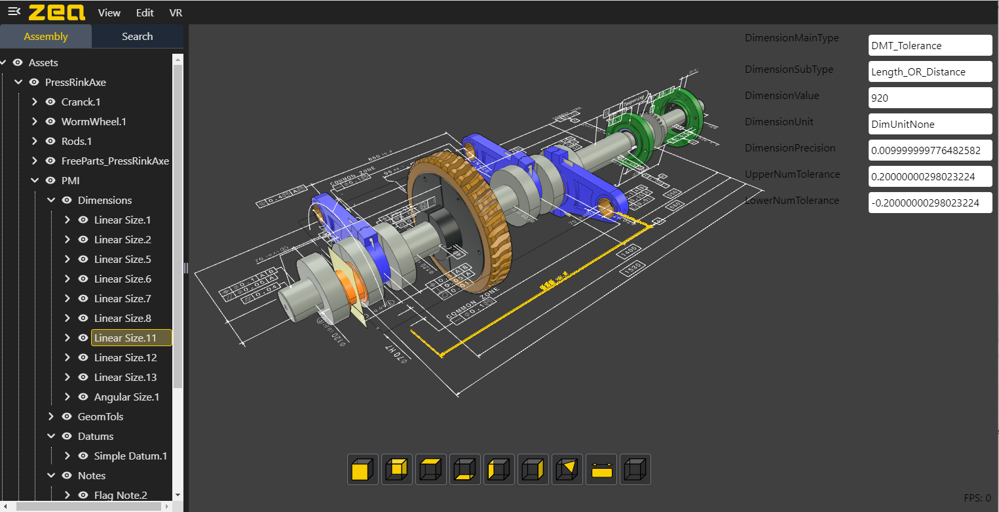

# Zea CAD Viewer

The zea-cad-viewer is an embeddable web application for viewing CAD data. It is intended to be integrated into host applications that might need to support displaying 3D cad data in the browser.

-

> https://cad-viewer-staging.zea.live/?zcad=data/PressRink.zcad

-

> https://cad-viewer-staging.zea.live/?zcad=data/Rod%20with%20PMI.zcad
